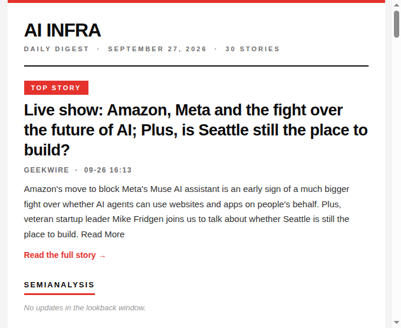

# Ripple — AI Infra Digest

> The 5-minute briefing for people who **build** and **bet on** AI infrastructure: inference serving, GPU orchestration, cost optimization, data centers — plus who's raising, who's getting acquired, and where the smart money is going.



## What you get

- **📬 Weekday digest** (~7:15 AM PT) — the day's essential AI infra news, curated from 11 sources, in a skimmable magazine-style email. Mondays cover the weekend.
- **💰 Funding & Startups** — a dedicated section tracking raises, IPOs, acquisitions, and new startups (with a Seattle lens via GeekWire).
- **📊 Weekly Insights** (Sundays) — not just news, but signal:
  - **Trend momentum** — what's heating up vs. cooling down, with velocity vs. the 4-week baseline
  - **Bottleneck radar** — the pain points the industry keeps complaining about, clustered with evidence
  - **Dots connected** — 3 startup theses synthesized from the week's news
  - **People moves** — hiring / founding / leaving signals

## Recent highlights

- British AI neocloud **Nscale secures $3.36B** in convertible financing ahead of its US IPO
- Enterprise browser startup **Island raises $400M** at a $6.4B valuation (Series F)
- **Databricks acquires** Seattle spreadsheet startup Row Zero
- 25 startups pitch investors at **AI House Seattle** — "Seattle's answer to YC Demo Day"

## Subscribe in 30 seconds

1. Click **[open a Subscribe issue](../../issues/new?title=Subscribe)**
2. Put your email address in the body and submit
3. A bot confirms you — the next digest lands in your inbox tomorrow morning

Each subscriber gets an individual email; addresses are never shared between recipients.

To unsubscribe, open an issue titled **Unsubscribe** with your email in the body.

*Note: subscriber emails are stored in `subscribers.txt` in this public repo, so they are visible to anyone.*

## Sources

| Source | Type |
|--------|------|
| SemiAnalysis | Industry analysis |
| Latent Space | Newsletter |
| Import AI | Newsletter |
| TLDR AI | Newsletter |
| Anyscale Blog | Company blog |
| Modal Blog | Company blog |
| vLLM Releases | Open-source project |
| SGLang Releases | Open-source project |
| TechCrunch AI | Funding & startups (filtered) |
| SiliconANGLE | Funding & startups (filtered) |
| GeekWire | Funding & startups (filtered) |

## How it works

Everything runs on GitHub Actions — no server to maintain:

- **Daily digest** (`.github/workflows/digest.yml`): weekdays at ~7:15 AM PT, fetches all sources, renders Markdown + HTML, and emails the HTML version (with a plain-text fallback).
- **Archive**: every run appends new items to `data/archive.jsonl`, so trends compound over time. Meaningful momentum signals emerge after 2–3 weeks.
- **Weekly Insights** (`.github/workflows/insights.yml`): Sundays ~7:15 AM PT, distills trend momentum, bottleneck radar, startup theses, and people moves from the archive.

### Self-host it

1. Create a Google app-specific password ([myaccount.google.com/apppasswords](https://myaccount.google.com/apppasswords)).
2. Add repo secrets: `GMAIL_USER`, `GMAIL_APP_PASSWORD`, and optionally `RECIPIENT` (comma-separated for multiple recipients — each gets an individual email).
3. It runs automatically. Trigger manually anytime via **Actions → AI Infra Daily Digest → Run workflow**.

### Local usage

```bash
pip install -r requirements.txt
python3 fetch.py --days 1        # Markdown digest
python3 render_html.py --days 1  # styled HTML email
```
